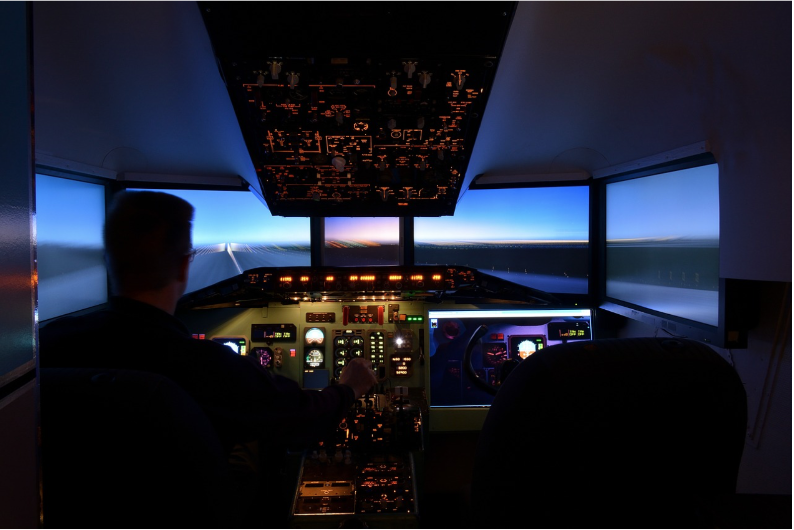

# Machine Learning Flight Simulator

To help you practice strategies for machine learning, the following exercise will present an in-depth scenario and ask how you would act. Consider airplane pilots who’s training involves time spent in flight simulators. These flight simulators accelerate the pilots’ learning by allowing them to experience a volume and variety of scenarios that they otherwise may have needed a much longer time to acquire.

The following exercise is a “flight simulator” for machine learning. Rather than you needing to spend years working on a machine learning project before you get to experience certain scenarios, you’ll get to experience them right here.

Personal note from Andrew: I’ve found practicing with scenarios like these to be useful for training PhD students and advanced Deep Learning researchers. This is the first time this type of “airplane simulator” for machine learning strategy has ever been made broadly available. I hope this helps you gain “real experience” with machine learning much faster than even full-time machine learning researchers typically do from work experience.
